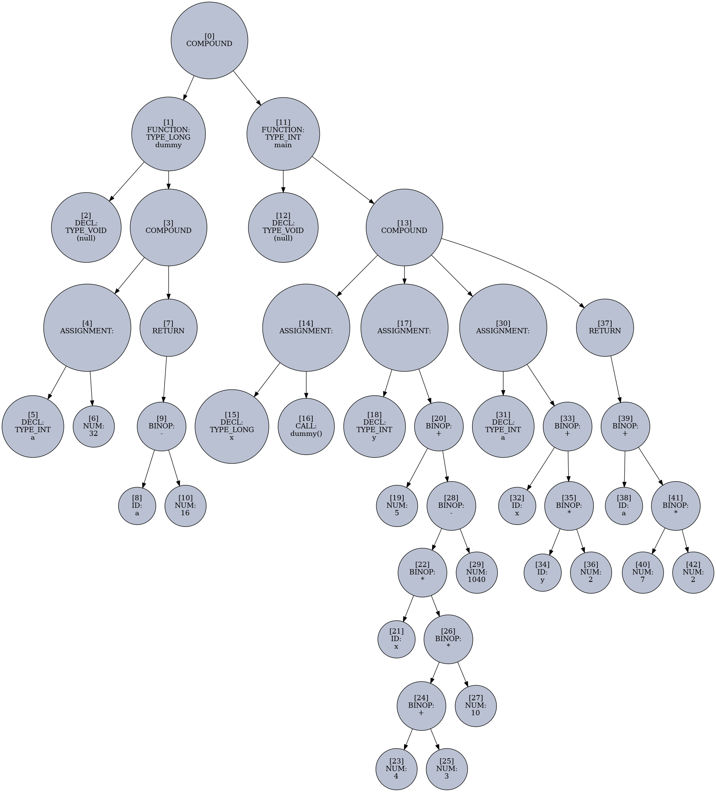

# BCC - Bad C Compiler

**Building a basic C compiler from scratch, for educational purposes and bragging rights.**

Outputs `x86 64-bit assembly`, nasm & gcc are used from there to create the binary file.

The goal is to compile basic programs, `#includes`, `typedefs` and other fancy things are forbidden.

This is a **non-optimizing compiler**, it doesn't make use of an intermediate representation phase.

Simplicity is valued more highly than support for more features. Will try to keep the entire thing under 3000 lines.

Taking inspiration from other (hobby) compilers, **no** memory management **is** the memory management scheme here.

Will not compile itself. Unless things get out of hand.

**Work in progress**

An example of what `bcc` can do as of now:

```
$ PLOT_EXPR=1 ./bcc tests/test11.c && echo "\nGenerated assembly:" && cat out.s && ./build.sh

Source Code:
long dummy(void)
{
  int a = 0x20;
  return a - 0x10;
}

// should return 200
int main(void)
{
  long x = dummy();
  int y = 5 + x * ((4 + 3) * 10) - 1040;
  int a = x + y * 2;
  return a + 7 * 2;
}

[*] Creating graph for: AST_BFS_0.txt
[*] Creating graph for: AST_BFS_1.txt
[*] Creating graph for: AST_BFS_2.txt
[*] Creating graph for: AST_BFS_3.txt

Generated assembly:
global dummy
global main

section .text

dummy:
push rbp
mov rbp, rsp
mov dword [rbp-0x4], 0x20
mov ebx, dword [rbp-0x4]
mov r8, 0x10
sub rbx, r8
mov rax, rbx
pop rbp
ret

main:
push rbp
mov rbp, rsp
sub rsp, 0x10
call dummy
mov qword [rbp-0x8], rax
mov rbx, 0x5
mov r8, qword [rbp-0x8]
mov r9, 0x4
mov r10, 0x3
add r9, r10
mov r10, 0xa
imul r9, r10
imul r8, r9
mov r9, 0x410
sub r8, r9
add rbx, r8
mov dword [rbp-0xc], ebx
mov rbx, qword [rbp-0x8]
mov r8d, dword [rbp-0xc]
mov r9, 0x2
imul r8, r9
add rbx, r8
mov dword [rbp-0x10], ebx
mov ebx, dword [rbp-0x10]
mov r8, 0x7
mov r9, 0x2
imul r8, r9
add rbx, r8
mov eax, ebx
leave
ret

[*] Building asm into executable...
[*] Running it and checking the return value
200

```

**Expression AST graph for `y` variable assignment:**



**Notes:**

```
Q: Why is there no "sub rsp, X" in all my functions, even though local variables are declared ?

A: The System V ABI for x86-64 specifies a red zone of 128 bytes below %rsp. These 128 bytes belong to the function as long as it doesn't call any other function (it is a leaf function).

Signal handlers (and functions called by a debugger) need to respect the red zone, since they are effectively involuntary function calls.
All of the local variables of your test_function, which is a leaf function, fit into the red zone, thus no adjustment of %rsp is needed. (Also, the function has no visible side-effects and would be optimized out on any reasonable optimization setting).

You can compile with -mno-red-zone to stop the compiler from using space below the stack pointer. Kernel code has to do this because hardware interrupts don't implement a red-zone.

--

TODO:

******* BUG - test12.c
When a function call is part of an expression,
if registers are already used by a first part of the expression
before the call is made, the called function might use the same registers again,
ruining the values they carry.

******* get puts working to print outside the range of [0, 255]
**** clean up lexer - repeating code
**** add unary operator support

labels
--
generate labels for every point we will be jumping to in the source code

keep track of general purpose registers - their names, and if they are in use.
pick the first not in use register to use


Parsing
--
implement conditionals, loops etc

Lexing
--
eventually implement more keywords to detect, but get basic asm generation working first

```
